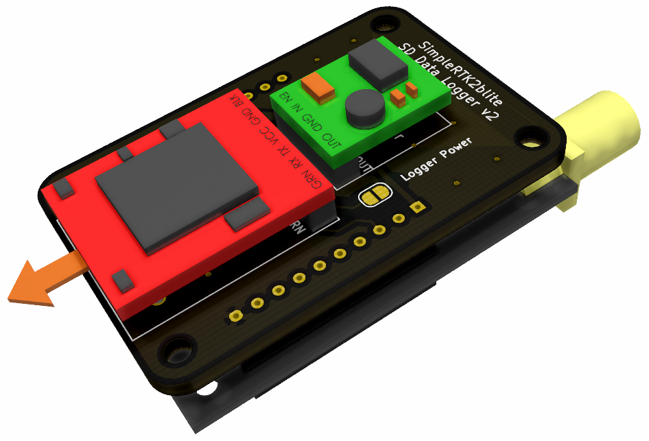

# SimpleRTK2Blite Logger Board
A simple logging board for the simpleRTK2BLite board from ArduSimple.  Uses COTS components to make assembly quick and easy.

Features:
- 5-36 V Input (XT30 Connector) 
- Logging to SD Card

## Hardware

## Software

### Configuration Files
